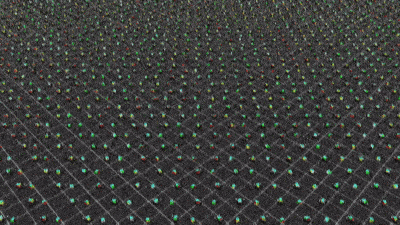
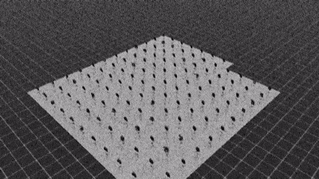

# Reinforcement Learning Based Dexterous Grasping with ROS2 Deployment

This repository contains the code, configuration, and deployment pipeline for training a Reinforcement Learning (RL) policy for dexterous grasping and in-hand reorientation using the **LEAP Hand v1**. 

The simulation and training are powered by **Isaac Lab** (Isaac Sim), and the trained policies are deployed and visualized using a full **ROS2 Humble** pipeline.

The repository is made for A100 GPU cluster which lacks docker support, in which jobs are not pushed via docker. IsaacLab and IsaacSim both are installed via source.

## Features

* **Dexterous Grasping:** Top-down vertical grasping and lifting of objects using PPO (RL-Games).
* **In-Hand Reorientation:** Boilerplate and training environments for SO(2) and SO(3) target poses.
* **Isaac Lab Integration:** Highly parallelized headless training on GPU clusters (NVIDIA A100).
* **ROS2 Deployment Pipeline:** Trajectory replay (`.npz` to ROS2) and live neural network inference visualized in RViz2.
* **Detailed Analytics:** Scripts for generating training metrics, joint trajectories, phase plots, and action smoothness graphs.

## System Architecture

The pipeline consists of two main loops:
1.  **Simulation & Training (Isaac Lab):** Runs the policy, computes rewards, updates network weights, and records joint states to `.npz` files.
2.  **Deployment & Visualization (ROS2):** Reads saved trajectories or runs live inference, publishing to `/hand/joint_commands` which are bridged to `sensor_msgs/JointState` for `robot_state_publisher` and RViz2.

## Installation & Setup

Due to Python version requirements (Isaac Lab uses 3.10, ROS2 typically uses 3.12 via micromamba), we maintain two separate environments.

### 1. Isaac Lab Environment
Use the repository launcher script to run Isaac Sim python:
* **Isaac Lab launcher:** `IsaacLab/isaaclab.sh`
* **Conda environment:** Activate the Isaac Lab environment (default: `isaac_fresh`).

For specific detailed understanding please refer these:
* `\leap_isaac_integration` for training the models and also initiating ROS2 scripts.
* `\leap_hand_rl_ros2` contains the scripts which integrate leap hand, isaaclab and ros2.
* `LEAP_Hand_Isaac_Lab` is the official LEAP HAND github folder.

### 2. ROS2 Workspace Build
Install/activate the ROS2 Humble environment (default: `ros_gpu`) and build the workspace:
```bash
source /opt/ros/humble/setup.bash
mkdir -p ~/ros2_ws/src
ln -sfn /path/to/leap_hand_rl_ros2 ~/ros2_ws/src/leap_hand_rl_ros2
cd ~/ros2_ws && colcon build --packages-select leap_hand_rl_ros2
```

### Some of the outputs 

Here are some visual demonstrations of the trained policies and the ROS2 deployment pipeline in action:

#### In-hand Reorientation training



#### In-Hand Reorientation output


#### Grasp and lift horizontal output


#### Grasp and lift vertical training (didnt converge)
